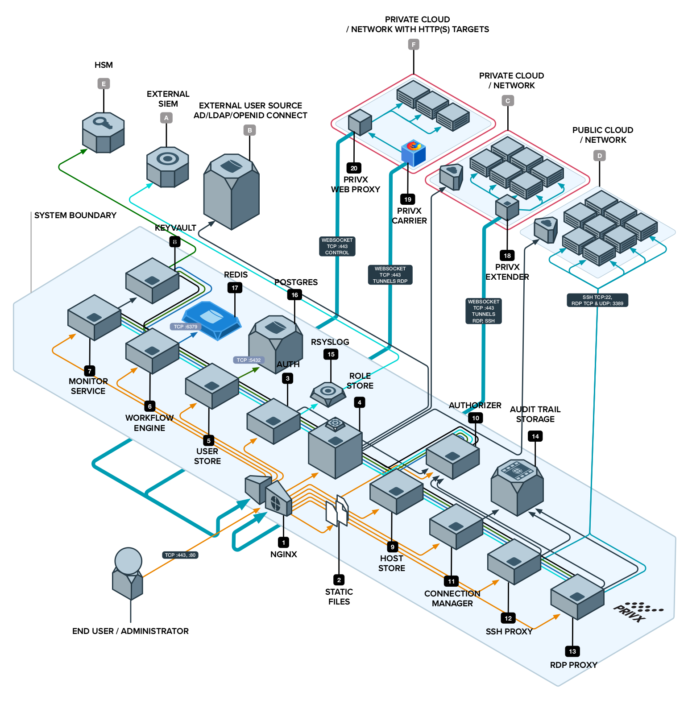

# PrivX on AWS

PrivX is lean privileged access management solution for your On-Prem, AWS, Azure and GCP infrastructure, all in one multi-cloud solution. This project simplifies PrivX on-boarding experience with deployment automation using Infrastructure as a Code.

[](http://travis-ci.org/SSHcom/privx-on-aws)
[](https://coveralls.io/github/SSHcom/privx-on-aws?branch=master)
[](http://github.com/SSHcom/privx-on-aws)
[](https://join.slack.com/t/privx-community/shared_invite/enQtNjM0NjYzMjU1NzkyLWJkYjNkYjViYTkyMjRjYWU0ZTM0MTQ5ZGIzODc5ZjNkNWU0ZmE5YjQ5ZDVhMmMxMmQyNGRlMGMyZTE0M2Y5NGE)


## Inspiration

Zero Standing Privileges improves established perimeter security. The perimeter security is based on network segmentation that separates trusted employees from untrusted one. It makes an optimistic assumption: everyone inside perimeter is trusted, outsiders are not trusted. However, anyone who breached perimeter becomes a trusted; an legitimate remote worker becomes untrusted with this model.

Just-in-time access management solves IAM challenges. **Please learn about it from our [presentation](https://www.youtube.com/watch?v=Atps1AiATVs)**

PrivX improves the process of granting and revoking access, ensures your engineering staff always have one-click access to the right infrastructure resources, and gives you an audit trail - vital if you are handling sensitive data or working in IT outsourcing.

PrivX is an ultimate replacement for jump hosts and bastions. It adds traceability to shared accounts using shared passwords, and conveniently combines access management for your On-Prem, AWS, Azure and GCP infrastructure, all in one multi-cloud solution.

**[Get PrivX Free](https://info.ssh.com/privx-free-access-management-software)**


## Getting Started

The latest version of Infrastructure as a Code is available at `master` branch of the repository. All development, including new features and bug fixes, take place on the `master` branch using forking and pull requests as described in contribution guidelines.


### Requirements

1. We are using [AWS CDK](https://github.com/aws/aws-cdk) and [TypeScript](https://github.com/microsoft/typescript) to code PrivX infrastructure components. You have to configure your environment with [node and npm](https://nodejs.org/en/download/) version 10.x or later.

```bash
## with brew on MacOS
brew install node

## then install CDK
npm install -g typescript ts-node aws-cdk
```

2. Obtain [access to target AWS Account](https://docs.aws.amazon.com/cli/latest/userguide/cli-chap-configure.html). You shall have ability to create/delete AWS resources.


### Deployments

Use AWS CDK command line tools to deploy PrivX to your AWS Account. **Please note**, the process consists of:

1. configure target AWS region
2. install dependent components
3. Obtain `subdomain`, `domain` name(s) and [configure AWS Route53 HostedZone](https://docs.aws.amazon.com/Route53/latest/DeveloperGuide/CreatingHostedZone.html). **Do not use any** non-alphabet characters including punctuation in the subdomain name.
4. Allocate unique class A network `cidr` block for AWS VPC
5. Email address to deliver CloudWatch alerts

```bash
##
## pre-config deployment process
export AWS_ACCESS_KEY_ID=Your-Access-Key
export AWS_SECRET_ACCESS_KEY=Your-Secret-Key
export CDK_DEFAULT_ACCOUNT=Your-Account-Id
export CDK_DEFAULT_REGION=eu-west-1
export AWS_DEFAULT_REGION=eu-west-1
npm install

##
## bootstrap AWS region with AWS CDK
cdk bootstrap aws://${CDK_DEFAULT_ACCOUNT}/${CDK_DEFAULT_REGION} \
  -c domain=example.com

##
## deploy PrivX
cdk deploy privx-on-aws \
  -c cidr=10.0.0.0/16 \
  -c subdomain=privx \
  -c domain=example.com \
  -c email=my.email@company.com
  -c sshkey=aws-keypair-name
```

In few minutes, your own instance of PrivX solution is available. Please check [our playbook](doc/playbook.md) or raise [GitHub issue](https://github.com/SSHcom/privx-on-aws/issues) if you have any troubles with deployment process.



Open a Web browser with your fully qualified domain name, e.g. `https://privx.example.com`.


The login credentials for `superuser` is available in your AWS Account:
1. Choose right region
2. Goto AWS Secrets Manager > Secrets > KeyVault...
3. Scroll to Secret value section
4. Click Retrieve secret value

In the final step, please obtain a [**license code**](https://info.ssh.com/privx-free-access-management-software) to activate your environment.


## Next Steps

* [Getting Started with PrivX](https://help.ssh.com/support/solutions/articles/36000194728-getting-started-with-privx)
* Learn more about [PrivX Users and Permissions](https://help.ssh.com/support/solutions/articles/36000194730-privx-users-and-permissions)
* Check [Online Administrator Manual](https://help.ssh.com/support/solutions/folders/36000185818)

## Bugs

If you experience any issues with the library, please let us know via [GitHub issues](https://github.com/SSHcom/privx-on-aws/issues). We appreciate detailed and accurate reports that help us to identity and replicate the issue.

* **Specify** the configuration of your environment. Include which operating system you use and the versions of runtime environments.

* **Attach** logs, screenshots and exceptions, in possible.

* **Reveal** the steps you took to reproduce the problem, include code snippet or links to your project.


## How To Contribute

The project is [Apache 2.0](LICENSE) licensed and accepts contributions via GitHub pull requests:

1. Fork it
2. Create your feature branch (`git checkout -b my-new-feature`)
3. Commit your changes (`git commit -am 'Added some feature'`)
4. Push to the branch (`git push origin my-new-feature`)
5. Create new Pull Request

The development requires TypeScript and AWS CDK

```bash
npm install -g typescript ts-node aws-cdk
```

```bash
git clone https://github.com/SSHcom/privx-on-aws
cd privx-on-aws

npm install
npm run build
npm run test
npm run lint
```

## License

[](LICENSE)
