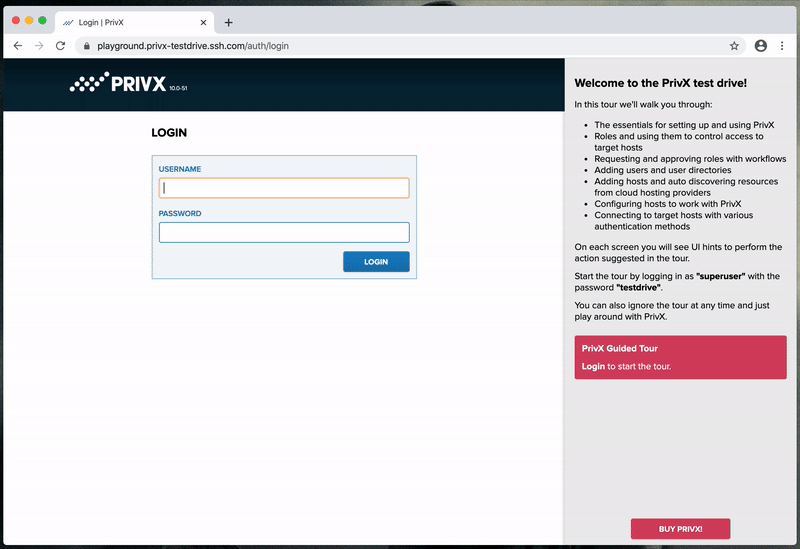
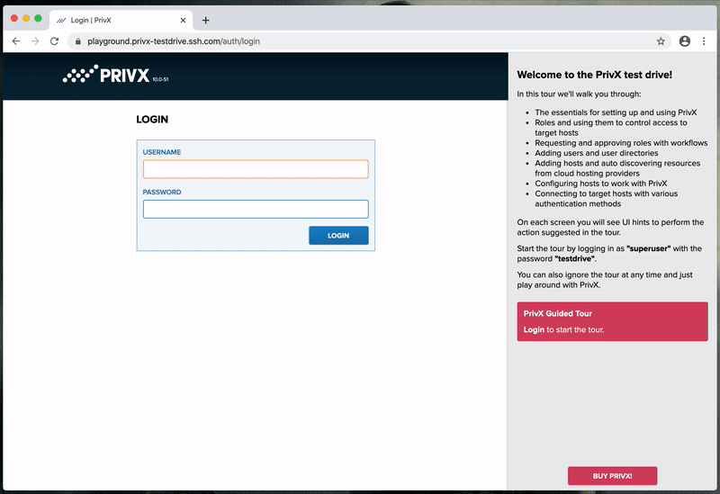

# PrivX Free - Just-in-time Access Management

> Available as Infrastructure as a Code on AWS for fast deployment.

PrivX is a lean and modern privileged access management solution to automate your AWS, Azure and GCP infrastructure access management in one multi-cloud solution. While it offers super great cloud experience, you can also easily connect your on-prem infrastructure to it for a single pane of glass access control and monitoring. This project further simplifies PrivX on-boarding experience with deployment automation using infrastructure as a code tooling.

[](http://travis-ci.org/SSHcom/privx-on-aws)
[](https://coveralls.io/github/SSHcom/privx-on-aws?branch=master)
[](http://github.com/SSHcom/privx-on-aws)
[](https://join.slack.com/t/privx-community/shared_invite/enQtNjM0NjYzMjU1NzkyLWJkYjNkYjViYTkyMjRjYWU0ZTM0MTQ5ZGIzODc5ZjNkNWU0ZmE5YjQ5ZDVhMmMxMmQyNGRlMGMyZTE0M2Y5NGE)


## Inspiration

Having seen how permanent passwords and left-behind and forgotten SSH keys enable access to critical environments years after they were actually created and needed, we started the PrivX project in order to get rid of the passwords and keys – to get rid of any permanent access altogether. We wanted to build a solution that only grants access when it's needed & on the level needed. Later on this approached was coined Just-in-Time-Access and the method as Zero Standing Privileges (ZSP) by industry analysts while part of the larger Zero Trust trend of always (re-)verifying a user before any access is granted.

PrivX automates the process of granting and revoking access by integrating & fetching identities and roles from your identity management system (LDAP, AD etc) and ensures your engineering and admin staff have one-click access to the right infrastructure resources at the right access level. You will also get full audit trail and monitoring - vital if you are handling sensitive data or for example open access for third parties to your environment.

PrivX is totally free for small environments and commercial subscriptions are available for more serious use. Download **[Your PrivX Free](https://info.ssh.com/privx-free-access-management-software)**.

To learn how PrivX works, please check out this **[video](https://www.youtube.com/watch?v=Atps1AiATVs)**.

### Screenshots




## Getting Started

The latest version of Infrastructure as a Code is available at `master` branch of the repository. All development, including new features and bug fixes, take place on the `master` branch using forking and pull requests as described in contribution guidelines.


### Requirements

1. We are using [AWS CDK](https://github.com/aws/aws-cdk) and [TypeScript](https://github.com/microsoft/typescript) to code PrivX infrastructure components. You have to configure your environment with [node and npm](https://nodejs.org/en/download/) version 10.x or later and install required components.

```bash
## with brew on MacOS
brew install node

## then install CDK
npm install -g typescript ts-node aws-cdk
```

2. Obtain [access to target AWS Account](https://docs.aws.amazon.com/cli/latest/userguide/cli-chap-configure.html). You shall have ability to create/delete AWS resources.

3. Obtain `subdomain`, `domain` name(s) and [configure AWS Route53 HostedZone](https://docs.aws.amazon.com/Route53/latest/DeveloperGuide/CreatingHostedZone.html). If you have a fresh AWS Account or missing domain name, you can [request one from AWS](https://docs.aws.amazon.com/Route53/latest/DeveloperGuide/domain-register.html).


### Deployments

Use AWS CDK command line tools to deploy PrivX to your AWS Account. **Please note**, the process consists of multiple stages:

```bash
##
## 1. clone privx-on-aws repository locally
git clone https://github.com/SSHcom/privx-on-aws
cd privx-on-aws

##
## 2. pre-config deployment process by configure environment and
##    installing dependent components  
export AWS_ACCESS_KEY_ID=Your-Access-Key
export AWS_SECRET_ACCESS_KEY=Your-Secret-Key
export CDK_DEFAULT_ACCOUNT=Your-Account-Id
export CDK_DEFAULT_REGION=eu-west-1
export AWS_DEFAULT_REGION=eu-west-1
npm install

##
## 3. configure and bootstrap target AWS region with AWS CDK.
##    Please note, the process requires domain name here.
##    the corresponding hosted zone must be properly configured otherwise
##    deployment fails.
cdk bootstrap aws://${CDK_DEFAULT_ACCOUNT}/${CDK_DEFAULT_REGION} \
  -c domain=example.com

##
## 4. deploy PrivX, you need to define a few variables here
##    subdomain   unique name of your privx instance. 
##                DO NOT USE any non-alphabet characters including 
##                punctuation in the subdomain name
##
##    cidr        allocate unique class A network `cidr` block for AWS VPC
##                default value 10.0.0.0/16 fits to majority of deployments
##
##    email       address to deliver CloudWatch alerts
##
##    sshkey      AWS SSH key pair to access PrivX instance for debugging 
##                purpose, keep empty to disable ssh access 
##                See more about ssh key from AWS documentation
##                https://docs.aws.amazon.com/AWSEC2/latest/UserGuide/ec2-key-pairs.html
##
cdk deploy privx-on-aws \
  -c cidr=10.0.0.0/16 \
  -c subdomain=privx \
  -c domain=example.com \
  -c email=my.email@company.com \
  -c sshkey=aws-keypair-name
```

In few minutes, your own instance of PrivX solution is available. Please check [**our playbook**](doc/playbook.md) or raise [**GitHub issue**](https://github.com/SSHcom/privx-on-aws/issues) if you have **any troubles with deployment** process. The deployment build entire [PrivX architecture](https://help.ssh.com/support/solutions/articles/36000205951-privx-architecture) in your AWS account.


Open a Web browser with your fully qualified domain name, e.g. `https://privx.example.com`.


The login credentials for `superuser` is available in your AWS Account:
1. Choose right region
2. Goto AWS Secrets Manager > Secrets > KeyVault...
3. Scroll to Secret value section
4. Click Retrieve secret value

In the final step, please obtain a [**license code**](https://info.ssh.com/privx-free-access-management-software) to activate your environment.


## Next Steps

* [Getting Started with PrivX](https://help.ssh.com/support/solutions/articles/36000194728-getting-started-with-privx)
* Learn more about [PrivX Users and Permissions](https://help.ssh.com/support/solutions/articles/36000194730-privx-users-and-permissions)
* Check [Online Administrator Manual](https://help.ssh.com/support/solutions/folders/36000185818)

## Bugs

If you experience any issues with the library, please let us know via [GitHub issues](https://github.com/SSHcom/privx-on-aws/issues). We appreciate detailed and accurate reports that help us to identity and replicate the issue.

* **Specify** the configuration of your environment. Include which operating system you use and the versions of runtime environments.

* **Attach** logs, screenshots and exceptions, in possible.

* **Reveal** the steps you took to reproduce the problem, include code snippet or links to your project.


## How To Contribute

The project is [Apache 2.0](LICENSE) licensed and accepts contributions via GitHub pull requests:

1. Fork it
2. Create your feature branch (`git checkout -b my-new-feature`)
3. Commit your changes (`git commit -am 'Added some feature'`)
4. Push to the branch (`git push origin my-new-feature`)
5. Create new Pull Request

The development requires TypeScript and AWS CDK

```bash
npm install -g typescript ts-node aws-cdk
```

```bash
git clone https://github.com/SSHcom/privx-on-aws
cd privx-on-aws

npm install
npm run build
npm run test
npm run lint
```

## License

[](LICENSE)
